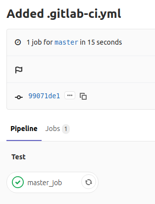
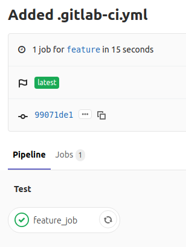
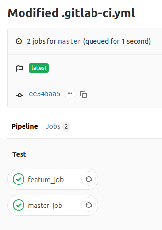
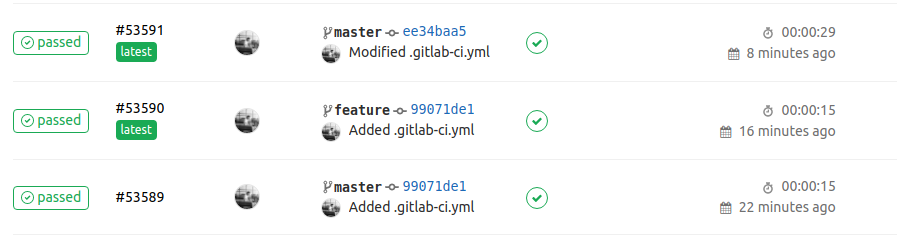

Images of pipeline for reference,

Job trigerred when pushed to master remote branch.

Job triggered when pushed to feature remote branch.

Job triggered after including both jobs for master branch, i.e. `only` in both jobs has `master` as the value.

Jobs are triggered only if the pushed commit has `.gitlab-ci.yml` file in root directory, irrespective to which remote branch the commit has been pushed. The jobs marked for the particular branch using the `only` will be triggered when pipeline is triggered for that particular branch or commit is pushed to that particular branch. However, jobs without `only` keyword will be triggered on all branches. And jobs limited to particular branches will be triggered only if pipeline is ran against those branches or commit is pushed to those branches. This is further explained in ex11.

