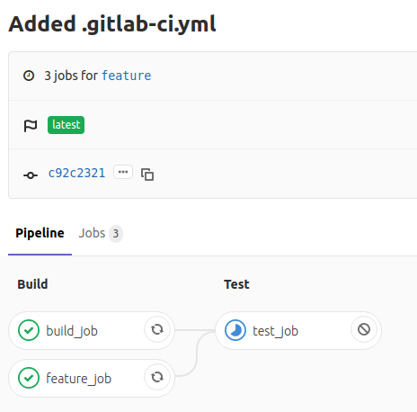

So, jobs not limited will be triggered on all branches. That is whenever commit is pushed to remote branch or pipeline is run against that branch.

Here, is image of pipeline triggered when commit was pushed to remote master branch.

Here, is image of pipeline triggered when commit was pushed to remote feature branch.

