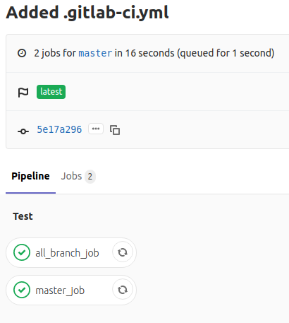
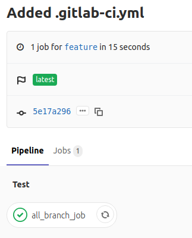
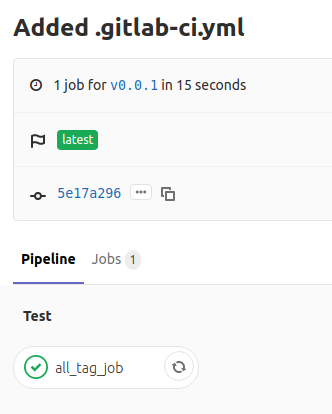
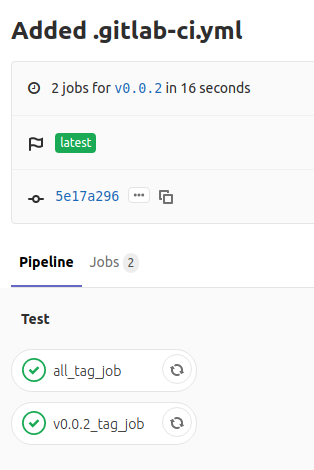
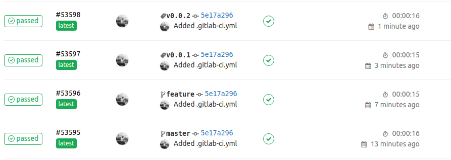
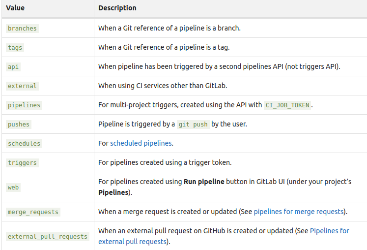

Below is image when commit was pushed to remote master branch.

Below is image when commit was pushed to remote feature branch.

Below is image when commit was pushed to remote tag v0.0.1

Below is image when commit was pushed to remote tag v0.0.2

Below image is of all pipeines for above cases.

To which all terms `only` could be referenced to,

