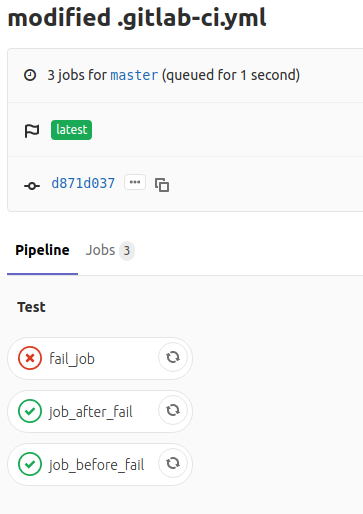

So, all jobs were triggered as they are in same stage.

fail_job failed and no effect was seen on other jobs.

I guess that a failed job will only produce effects on stage jobs which are after its stage.

Here is the image,

