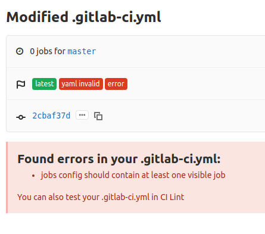

So, it is confirmed that if we don't define any visible job in our `.gitlab-ci.yml`, it gives an error of `invalid yaml`.

The error image is as below, 

This could be verified from `CI LINT` option as well. This option validates our `.gitlab-ci.yml` file. This option is available in top right c
orner of the `CI/CD->pipelines` option in Gitlab.
